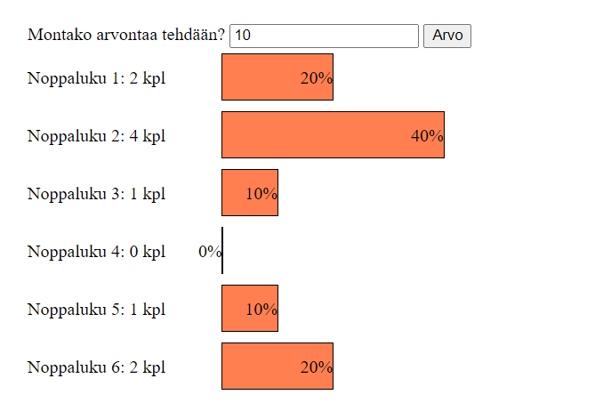
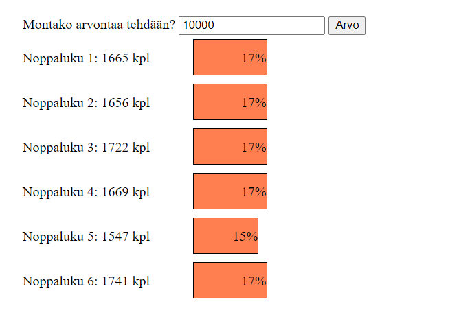

# Array

We have randomly generated dice numbers using the Math.random() function: `Math.floor(Math.random() * 6 + 1)`.

With uniformly distributed random numbers, the probability of each number is equal. But how random are the numbers produced by the function? Let's investigate!

## Task: How random is a dice number?

Create a program that generates a large number of random dice numbers. Record the frequency (occurrence rate) of each number and see if they are the same for all numbers.

The idea of the solution is this:
- Create an array for the frequencies of different dice numbers (1-6).
- Generate, for example, 10,000 dice numbers. Each time a number is generated, increase the frequency (number of occurrences) of the generated number in the array item corresponding to the number.
- Finally, print the relative frequency (percentage) of each number out of all generated numbers. If the numbers are random, the percentage for each number should be the same.

The task template includes a ready-made program and styles, so you only need to create the program logic in the JavaScript file.

### Creating the bars in the chart
You can add a bar into the chart by calling the function `addBar` and providing it with three parameters: the dice number, the frequency of the dice number (i.e., count), and the relative frequency (i.e., percentage of all), e.g., `addBar(6, 234, 15.67)`.

## Bonus tasks

Challenge yourself with bonus tasks to reach the next level!

Try different random number generation functions. Do they produce a uniform distribution? Can you create a weighted die, i.e., a die that produces biased results in a specific way?

