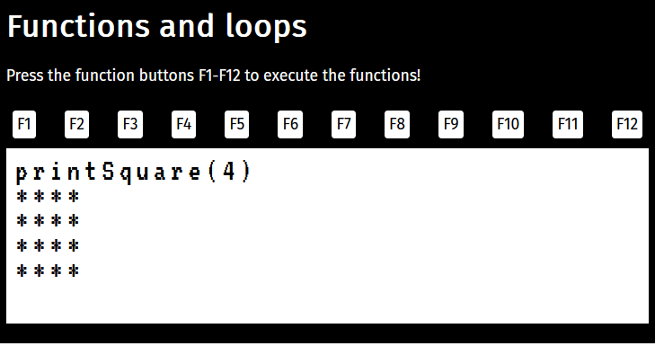

# Functions and loops

Functions are perhaps the most important tool in programming; they are used constantly in all programs. Functions can have parameter variables that receive their values when the function is called. Often, functions return a value as a result (return value). In an expression, a function call is replaced by its return value.

Loop structures are one of the fundamental constructs in programming: something is iterated (done multiple times) based on whether a condition is true. The iteration stops when the loop condition is no longer true.

In this task, we will practice both of these cornerstones of programming.



## Tasks
Your task is to implement a set of JavaScript functions for a web page. The HTML of the page is ready-made, and the page already implements a JavaScript user interface that uses the functions you implement.

Function `println(text)` is provided for output. It prints a single line to the screen, i.e., the value of the parameter `text` followed by a line break. Use only this function for printing!

Write all functions in the file `script.js`.

1. Implement function `printEvens` that prints even integers from 2 to 20.

2. Impelement function `fromOneTo` that prints integers from 1 to a number given as a parameter.

3. Implement function `fromTo` that prints integers from a number given as a parameter to another number given as a parameter.

4. Implement function `printStars(count)` that prints the given number of stars followed by a line break. For example, the call `printStars(9)` prints:
    ```console
    *********
    ```

5. Implement function `printSquare(sideLength)` that prints a square using the `printStars` function. For example, the call `printSquare(4)` prints:
    ```console
    ****  
    ****  
    ****  
    ****
    ```

6. Implement function `printRectangle(width, height)` that prints a rectangle using the `printStars` function. For example, the call `printRectangle(17,3)` prints:
    ```console
    *****************
    *****************
    *****************  
    ```

7. Implement function `printTriangle(size)` that prints a triangle using the `printStars` function. For example, the call `printTriangle(5)` prints:
    ```console
    *  
    **  
    ***  
    ****  
    *****
    ```

8. Implement function `sumSeries(n)` that _returns_ (does not print!) the sum of 1+2+3+...+n, where `n` is the number given as a parameter. For example, for the number 100, the result is 5050.

9. Implement function `factorial(n)` that returns the factorial of the number n. The factorial n! is calculated using the formula 1\*2\*3\*...\*n. For example, the factorial of 4 is 24, i.e., 4! = 1\*2\*3\*4 = 24. Additionally, it is defined that the factorial of 0 is 1, i.e., 0! = 1. For example, the factorial of 10 is 3628800.

10. Finally, implement function `runAll()` that runs all the functions in the exercise and adds headings in between to indicate which task is currently being executed.


## Bonus
A _recursive function_ calls itself with a suitable new parameter value. The execution of the calling function is then paused, and this continues until the termination condition of the function is met. This last call completes and returns a value, and the entire call stack starts to unwind as each call completes and returns a value to the previous one. The desired result is then obtained from the first call.

Some programming algorithms can also be naturally designed as recursive. Here are a couple:

11. Implement function `recursiveSum(n)` that calculates and returns the sum of a series of numbers using a recursive algorithm.

12. Implement function `recursiveFactorial(n)` that calculates and returns the factorial using a recursive algorithm.

## Hints

- Keep the browser console open to see if any errors appear there. An error message will tell you what the error was and on which line it was detected.
- When working with loop structures, it is sometimes possible to write loops that never end. If the page seems unresponsive and no errors are visible, check if it has entered an infinite loop.