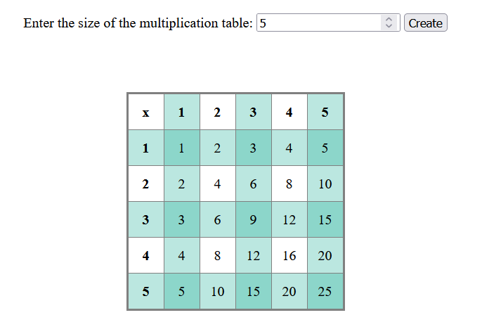
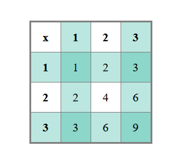
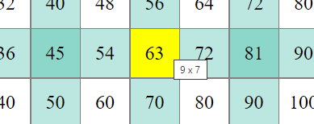

# Loop Structures

The goal is to get familiar with loop structures by creating a two-dimensional table. This requires repetition multiple times, and at the same time, we will practice creating HTML tables.

## Task: Multiplication Table

The task is to create a page that can generate multiplication tables. The user inputs the desired size of the multiplication table, and the program displays it as an HTML table.



In the table, the first row and the first column contain the multipliers, and the intersections of the rows and columns contain their products.

The task template includes a ready-made program, and the styles are already defined, so you only need to create the multiplication table.

## Tips

Here is an example of a multiplication table up to three, shown both as a screenshot and the corresponding HTML code (comments are for clarification and are, of course, not needed).



```html
<table id="table">
    <!-- header row -->
    <tr>
        <th>x</th>
        <th>1</th>
        <th>2</th>
        <th>3</th>
    </tr>
    <!-- multiplication rows -->
    <tr>
        <td>1</td> <!-- multiplier -->
        <td>1</td> <!-- products -->
        <td>2</td>
        <td>3</td>
    </tr>
    <tr>
        <td>2</td> <!-- multiplier -->
        <td>2</td> <!-- products -->
        <td>4</td>
        <td>6</td>
    </tr>
    <tr>
        <td>3</td> <!-- multiplier -->
        <td>3</td> <!-- products -->
        <td>6</td>
        <td>9</td>
    </tr>
</table>
```

There is a template for task, you only need to modify the JavaScript file contents. 

## Hints

- You will need nested loop structures for this task.
- You can write HTML elements as plain text in the content (e.g., `"<th>Header</th>"`).

## Bonus Tasks

Challenge yourself with bonus tasks to reach the next level!

### Tooltip

Add a tooltip to the table cells that shows the multiplication operation whose result is in the cell. The HTML attribute `title` sets the tooltip text for an element.




