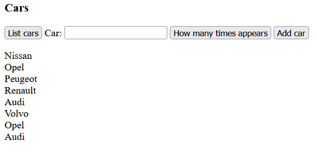
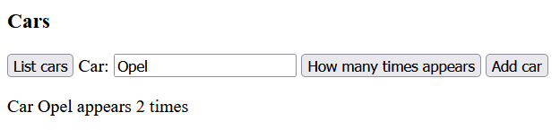
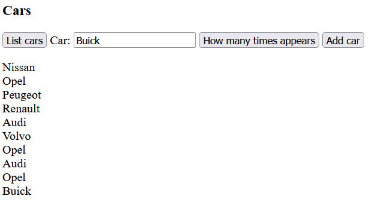
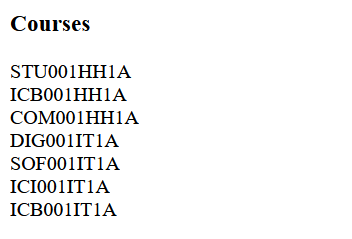
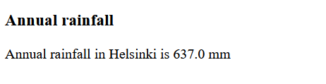
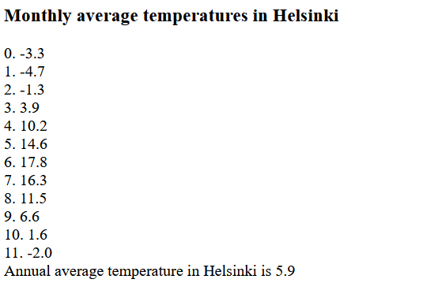

# Arrays

## 1. Cars

The array to be used is:

```js
let cars = ["Nissan", "Opel", "Peugeot", "Renault", "Audi", "Volvo", "Opel", "Audi"];
```

### a) Create a program that lists the cars in the array

> 

- Declare the array inside a script element.
- List the array using a for loop.

    ```js
    // Declare a variable to collect the cars in the array
    let text = "";

    // Iterate through the array and collect the cars into the text variable
    for (let i = 0; i < cars.length; i++) {
        text = text + cars[i] + "<br>";
    }
    ```

- Write the result to an HTML page.

### b) Create a program that tells how many times a specific car appears in the array.

> 

- The search is done using a for loop, where each car in the array is compared to the value of the input field using `if (cars[i] == searchValue)`.

- Declare a `count` variable (initialize it to zero) above the loop to store the number of occurrences.

- If the loop finds that the car in the array matches the value of the input field, increment the `count` variable by one.

```js
let count = 0;

// Iterate through the array and collect the values into the text variable
for (let i = 0; i < cars.length; i++) {
    // If the value in the array matches the value of the input field
    if (cars[i] == searchValue) {
        count = count + 1;
    }
}
```

### c) Create a program to add a new car to the array

> 

## 2. Courses

Create a program that displays the course codes for the first semester.

The array is:

```
let courses = ["STU001HH1A", "ICB001HH1A", "COM001HH1A", "DIG001IT1A", "SOF001IT1A", "ICI001IT1A", "ICB001IT1A"];
```

> 

## 3. Rainfall

Create a program that calculates the annual rainfall in Helsinki.

> 

Below is an array containing the rainfall for each month.

```js
let rainfall = [47.0, 36.6, 34.7, 37.0, 41.9, 47.5, 61.7, 74.8, 65.4, 69.7, 66.1, 54.6];
```

The code is conceptually:

```js
let total = 0;
for (let i = 0; i < rainfall.length; i++) {
  // total = total + the value at index i in the array
}

// write the result
```

## 4. Temperatures

Create a program that displays the average monthly temperatures in Helsinki and their average.

> 

Below is an array containing the average temperature for each month.

```js
let temperatures = [-3.3, -4.7, -1.3, 3.9, 10.2, 14.6, 17.8, 16.3, 11.5, 6.6, 1.6, -2.0];
```

The code is conceptually:

```js
let text = "";
let total = 0;

for (let i = 0; i < temperatures.length; i++) {
  // text = text + (i+1) + ". " + the value at index i in the array
  // total = total + the value at index i in the array
}

let average = total / temperatures.length; // why?

// write the result
```

- The `toFixed(1)` method can be used to format the result to one decimal place.


