<style>
	img { width: 400px; }
</style>

# Conditional statement

## 1. Loyalty discount

A retail chain customer loyalty program gives discounts on purchases according to the following table:

| Purchase      | Discount |
| :------------ | :------- |
| Less than 300 | 2%       |
| Less than 600 | 3%       |
| 600 or more   | 4%       |

Write a program that calculates the discount received from a purchase and the price after the discount.

>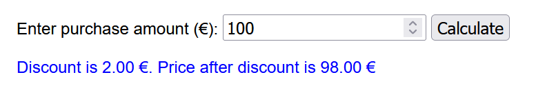

>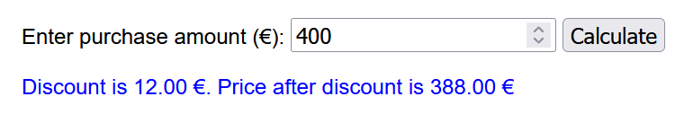

>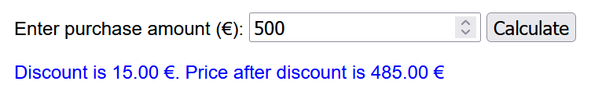

__Hints__

The idea of the code is:

```function calculateDiscount() {
assign the value from the form field to a variable
	if (purchases < 300) {
		discount is 2% (purchases * 0.02)
	} else if (purchases < 600) {
		discount is 3% (purchases * 0.03)
	} else {
		discount is 4% (purchases * 0.04)
	}
	price is purchases - discount
}
```

## 2. Greeting

Write a program that greets the user based on the hour of the day.

If the hour is:
- 6-11: Good morning
- 12-18: Good afternoon
- 19-23: Good evening
- Otherwise: Good night

>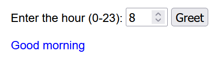


## 3. Public broadcasting tax

Income from wages is subject to a public broadcasting tax.

- The public broadcasting tax is 2.5% of the annual income exceeding 15150 euros but at most 160 euros.
- No public broadcasting tax is paid if the income is less than 15150 euros.
- Persons under 18 years are exempt from public broadcasting tax.

Write a program that calculates the amount of the public broadcasting tax when the annual income and age are given.

>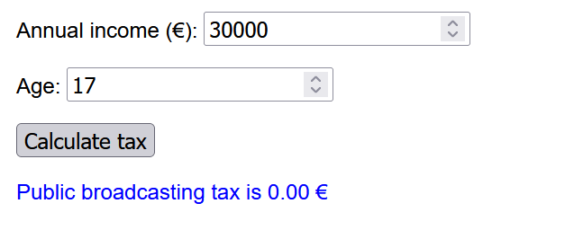

>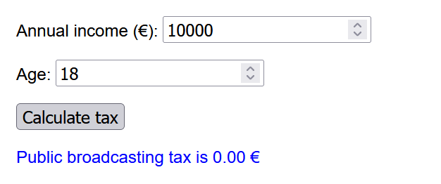

>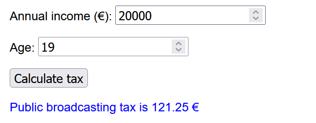

>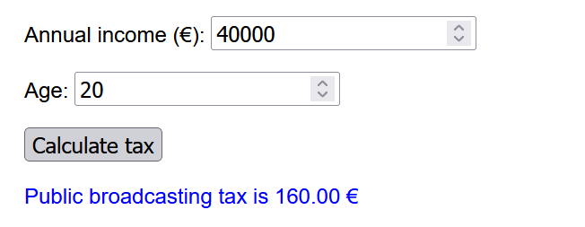

__Hints__
- The formula for calculating the tax is `(annual income – 15150) * 2.5/100`.

## 4. Pole length

Write a program that calculates the pole length used in Nordic walking, classic skiing or skating skiing. 

The formulas for calculating the pole lengths are:
- Skating skiing: user height * 0.9
- Classic skiing: user height * 0.85
- Nordic walking: user height * 0.68

>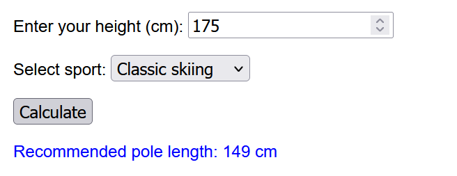 

>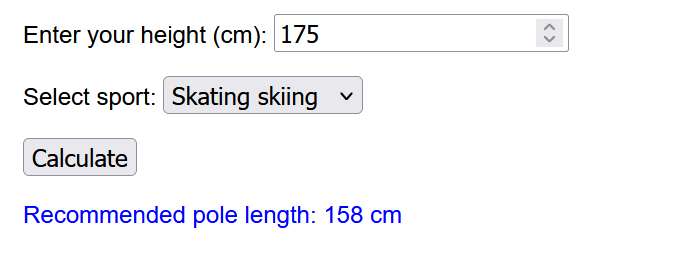 

>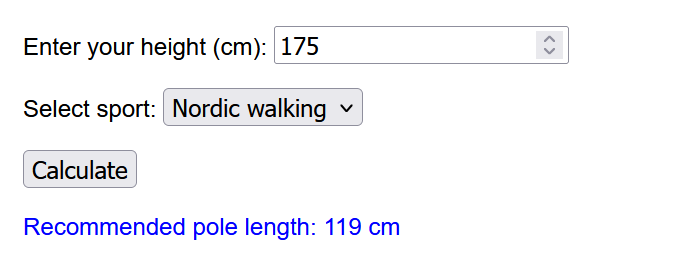

__Hints__

- You can make a dropdown list in HTML like this:
	```html
	<select id="sport">
		<option value="classic">Classic skiing</option>
		<option value="skating">Skating skiing</option>
		<option value="nordic">Nordic walking</option>
	</select>
	```

- The selected sport from the dropdown can be determined in JavaScript like this:
	```javascript
	let sport = document.getElementById("sport").value;
	```


          


 
