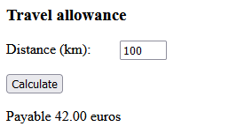
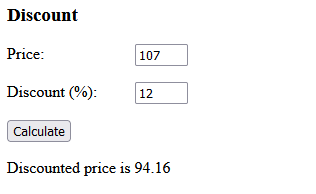
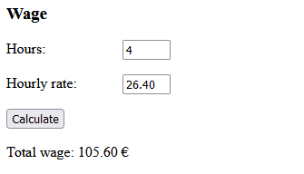
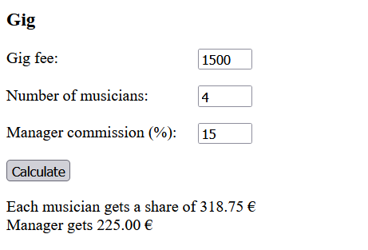
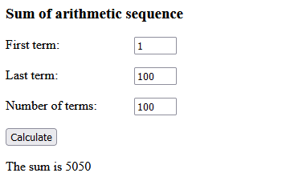
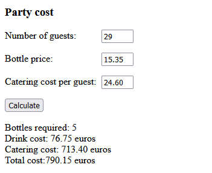
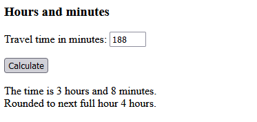

# JavaScript basics

Reading a form field, writing to an HTML page, assignment statement and calculation, formatting a decimal number.

## Setting up the Environment

1.  Create a new working folder on your computer for this assignment.
2.  Copy the files from folder `templates` to the folder.

## Tasks

### 1. Travel allowance

Write a program that asks for the driven kilometers, calculates and displays the travel allowance. The allowance is 0.42 euros/kilometer.

> 

The logic of the program is to write a function that will be called when the user clicks button. The idea of the function is:

```
function calculate() {
  read the value from the kilometers field in the form
  calculate the kilometer compensation
  write the answer to the HTML page
}
```

Assign the value of the form field to a variable:

```
let km = document.getElementById("distance").value;
```

The form field on the html page looks like this:
```
<input type="text" name="distance" id="distance" size="5" />
```

Write the answer to the HTML page (`allowance` is variable containing the sum):

```
document.getElementById("answer").innerHTML = "<p>Payable " + allowance.toFixed(2) + " euros</p>";
```

You can format the number with two decimals using the `toFixed(2)` method.

### 2. Discount

Write a program that calculates the discounted price of a product. The program asks for the original price of the product and the discount percentage. The program outputs the discounted price.

> 

The discounted price is calculated: `price * (100.0 - discount percentage) / 100`.

You can align the fields to start at the same position

```
<style>
  label {
    display: block;
    width: 8em;
    float: left;
  }
</style>
```

### 3. Wage

Write a program that asks for the hours worked and the hourly wage, and calculates the total wage. The answer is formatted with two decimal places.

> 


### 4. Gig fee

Your band manager takes a commission from the gig fees. Band members share earnings from a gig equally after the manager's commission has been deducted. The band lineup varies, there may be different number of musicians on different gigs.

Write a program that counts the payment for a single band member and the manager commission when the gig fee, number of musicians and commission percentage is given.

> 

Define a text variable for the output and construct all the output there. When writing the result to the document, just assign the variable value to the result element contents.

__Hints__
- You can add a line break by adding a `<br>` tag to the output. 


### 5. Sum of an arithmetic sequence

An arithmetic sequence is a sequence of numbers where the difference between any two successive terms is always the same. For example, the sequence 1, 2, 3, 4, 5 is an arithmetic sequence with a common difference of 1.

Write a program to calculate the sum of an arithmetic sequence when the user enters the first and last term of the sequence and the number of term. 

> 

The formula for the sum is

```math
 sum = n { a + b \over 2}
```
where 
- $n$ is the number of terms in the sequence
- $a$ is the first term and
- $b$ is the last term of the sequence.

__Hints__
- Think of the order of operations!


### 6. Party cost

Write a program to calculate the costs of a party. The program asks for the number of invited guests, the price of a single bottle of sparkling wine, and the price of catering per guest. One bottle yields 7 glasses.

> 

__Hints__
- You can round up the number of bottles to the next whole integer using the `Math.ceil()` method.


### 7. Hours and minutes

On a trip to the cottage, you stop for a break. During the break, the travelers want to practice their mental arithmetic skills. The task is to calculate the time spent on the trip in hours and minutes, as well as rounded up to the nearest hour, when the time spent is given in minutes. 

Write a program that gives the correct answers.

> 

__Hints__
- You can get the minutes using the `%` (modulo) operator.
- You can get the integer part of the division using the `Math.floor()` method.
- You can round up the division using the `Math.ceil()` method.
