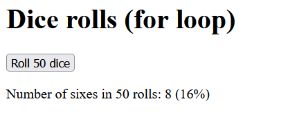
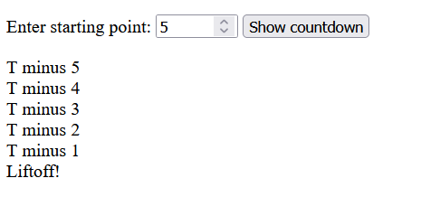
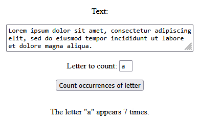

<style>
	img { width: 400px; }
</style>

# Loop structures (while and for)

## 1. Dice rolls

### a) 

Write a program that counts how many dice rolls are needed to get a 6. Use `while` statement.

>

__Hints__

- The idea of the code is:

  ```
  initialize the count variable to one (let count = 1)
  roll the die (let die = Math.floor((Math.random() * 6) + 1))
  while (die is not equal to 6) {
      increase the count variable by one
      roll the die
  }
  show the answer
  ```

### b) 

Write a program that rolls dice 50 times and tells how many times the number 6 appeared. Use `for` statement.

>

__Hints__

- The idea of the code is:
  ```
  initialize the lkm variable to zero
  for (var i=1; i<=50; i++) {
      roll the die
      if (die == 6)
          increase the lkm variable by one
  }
  show the answer
  ```

## 2. Insurance

Write a program that displays the insurance payment installments.

>

__Hints__

- The idea of the code is:

  ```
  calculate the amount of a single installment
  initialize a text variable as an empty string
  for numberOfInstallments {
    add a line of text to the text variable
  }
  show the answer
  ```
- A single installment is calculated `insurancePayment / numberOfInstallments`

## 3. Credit

Write a program that asks for the price of a purchase made on credit and the number of installment months. 

The program prints the amount to be paid each month and the remaining credit after each month.

>

## 4. Savings

Write a program that shows the growth of savings. 

The program asks for the savings goal, the monthly saving amount, and shows how the savings grow. 

>

## 5. Countdown

Create a countdown from a specified number to 0. Use a while loop.

The program outputs the countdown until liftoff is reached at zero.

>

## 6. Reverse text

Write a program that reverses text.

The program asks for a text and shows it reversed.

>


## 7. Count letters

Write a program that counts how many times a letter appears in a text.

The program asks for the text passage and the letter to search, and shows the number of occurrences of the letter.

>

__Hints__

- String literals can be defined also using single quotes (e.g. `'literal'`). If you do so, you can include double quote characters (`"`) in the string.


