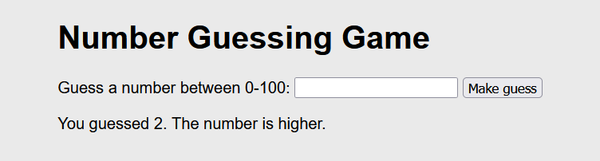
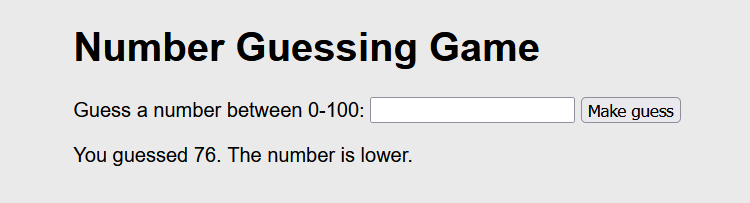
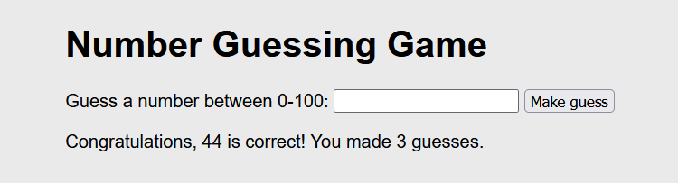
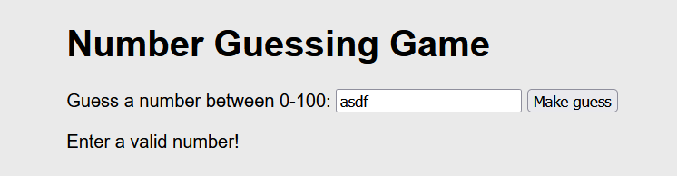

# Conditional Statements

The goal of this task is to get familiar with and practise using conditional statements in JavaScript so that you can progress in programming towards creating more interesting programs and better equip yourself to learn more independently.

## Task: Number Guessing Game

The task is a classic programming exercise: a number guessing game. 

The number to be 
guessed is randomly generated between 0-100. After the player makes a guess, the game will indicate whether the number to be guessed is higher or lower.

  
  
  

When the player guesses correctly, the game will display the number of attempts.

  

Feel free to style the game as beautifully as you can!

There is a template for task, you only need to modify the JavaScript file contents. 

## Bonus Tasks

Challenge yourself with bonus tasks to reach the next level! 

1. __Input Validation__: Make sure that the user inputs a number and not anything else. Add a check to the conditional structure to provide the user with instructions for valid input if the input was not a number.

  

2. __Game Restart__: Add a suitable element to the page for resetting the game, define a function to reinitialize the game, and set the function as the onclick handler for the new element.

3. __Mind-Blowing Game Ending__: The basic game ending is quite modest. Come up with something 
spectacular to celebrate the user's success.

## Tips
- The comments in the template code provide hints for creating the solution, so read the 
comments carefully!
- For the bonus task, you can use the `isNaN()` function.
